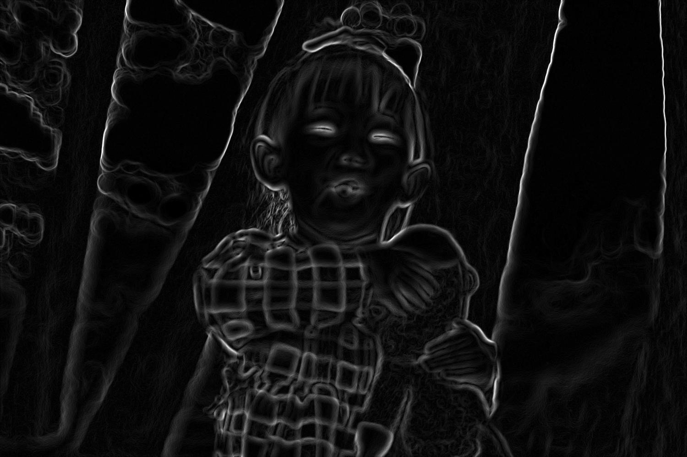

<div align="center">
  <h1 align="center" style="border-bottom: none"><b>Advanced Image Editing System</b></h1>

  <p align="center">
  This project was developed as part of the <b>Lightricks Students Home Assignment</b>.
  <br>
  It showcases an image editing tool built from scratch in Python, using <b>NumPy</b> for core operations and implementing convolution-based filters and adjustments without any external image-processing libraries.
  <br>
  The system is modular, extensible, and configurable via a <b>JSON file</b>, and supports both saving and displaying the final result.
  </p>
</div>

<br>

<div align="left">
  <h2 align="left" style="border-bottom: 1px solid gray">Features</h2>
  <ol align="left">
    <li><b>Modular Design</b> - Each operation is cleanly separated to allow for easy extension and maintenance.</li>
    <li><b>JSON-Based Configuration</b> - Users can define image paths, filters, parameters, and save/display options using a structured input file.</li>
    <li><b>Supported Filters</b>:
      <ul>
        <li><b>Box Blur</b> – Averages pixel values in an X×Y neighborhood to produce a softened effect.</li>
        <li><b>Sobel Edge Detection</b> – Highlights image edges using horizontal and vertical gradient kernels.</li>
        <li><b>Sharpen</b> – Enhances image details using the unsharp masking technique.</li>
      </ul>
    </li>
    <li><b>Supported Adjustments</b>:
      <ul>
        <li><b>Brightness</b> – Adjusts pixel intensity globally.</li>
        <li><b>Contrast</b> – Stretches or compresses pixel value distribution.</li>
        <li><b>Saturation</b> – Modifies color vibrancy (in RGB approximation).</li>
      </ul>
    </li>
    <li><b>Sequential Layering</b> - Applies operations in the exact order specified by the user.</li>
    <li><b>Validation & Error Handling</b> - Provides clear messages for invalid configuration files.</li>
    <li><b>Display or Save Output</b> - Allows visualizing the result or saving it to a file based on user input.</li>
    <li><b>CLI Integration</b> - Run the tool via command line with a single command.</li>
  </ol>
</div>
<br>

<div align="left">
  <h2 align="left" style="border-bottom: 1px solid gray">Media</h2>

  <p>Here are a few examples of images edited using the tool and the filters described above:</p>

  <div align="left">
    <h4>Original Image</h4>
    
    <h4>Box Blur (5x5)</h4>
    
    <h4>Sobel Edge Detection</h4>
    
    <h4>Pipeline (multiple filters layered)</h4>
    
  </div>
</div>

<br>

<div align="left">
  <h2 align="left" style="border-bottom: 1px solid gray">Running the Project</h2>

  <p>To try it out locally, follow these steps:</p>
  <ol align="left">
    <li>Clone the repository: <code>git clone &lt;url&gt;</code></li>
    <li>Open the folder in your preferred code editor</li>
    <li><i>Optional:</i> Set up a virtual environment using <code>python3 -m venv venv</code></li>
    <li>Install dependencies: <code>pip install -r requirements.txt</code></li>
    <li>Run the editor with: <code>python3 edit_image.py --config path/to/config.json</code></li>
  </ol>
</div>

<br>

<div align="left">
  <h2 align="left" style="border-bottom: 1px solid gray">Example JSON Configuration</h2>

```json
{
  "input": "image.png",
  "output": "output.png",
  "display": true,
  "operations": [
    {
      "type": "brightness",
      "value": 0.6
    },
    {
      "type": "box",
      "width": 5,
      "height": 3
    },
    {
      "type": "contrast",
      "value": -3
    }
  ]
}
